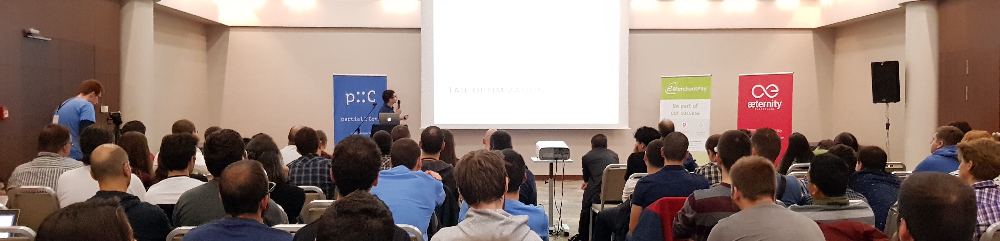
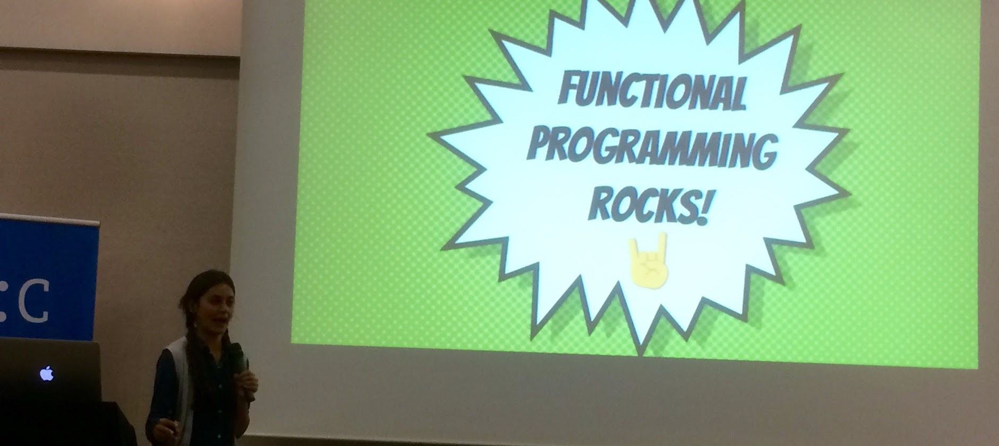
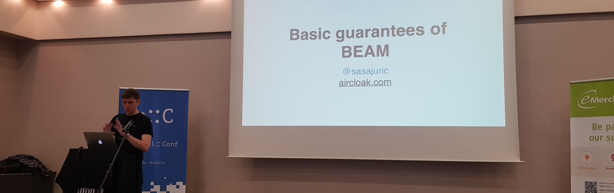
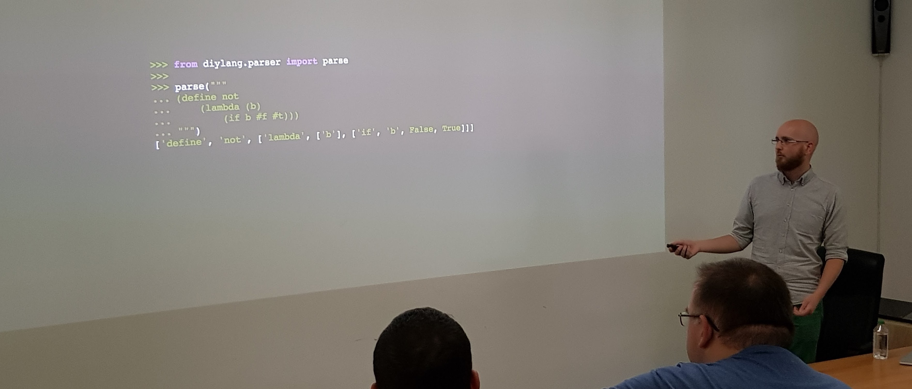
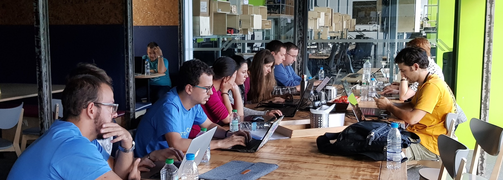

# Partial::Conf

Partial::Conf is a new functional programming conference in Sofia, Bulgaria, held for the very first time last week. We were there, both to attend and to give a workshop. Since the conference is small and new, it might not yet be on your radar, though it definitely should be!

## The Conference

Partial is a single track, two day conference. The [program](http://partialconf.com/schedule) consisted of 40 minutes talks throughout the first day, and the first half of the second. The last afternoon was dedicated to workshops, with ours being one of the choices.

There were also plenty of chances to mingle and talk to people. In addition to breaks between the talks, and the long lunch breaks, it was also an option to attend a guided tour of Sofia (for those not interested in the workshops). And finally, there were the conference party at a local nightclub on the second night.

We met a lot of interesting and friendly people. Not only among the attendees and speakers, but the organizers were also exceptionally welcomming and accomodating. It's not often arriving on the night before a conference is one of the highlights. At Partial it was, though. We were picked up at the airport by a representative from the organizers, whom, after letting us drop our luggage of at the AirBnB, drove us to the speakers dinner. There we got to taste some great examples of the local cuisine, as well as a fair share of their fruit brandy _Rakia_.

## The Talks

The talks at Partial generally held a high level of quality. The topics were for the most part very accessible to newcommers to FP. There were more in the ways of inspiration and introduction than the really heavy technical deep dives, though without being too basic. This is not a conference to attend if you want to geek out over type systems or category theory, but might be one for you if you're interested in building real software with a functional mindset. 

There are a few talks we would like to highlight. (Videos of the presentations aren't out quite yet, but we'll update the blogpost whith links when they arrive.)

#### Bozhidar Batzov: Clojure: The Bad Parts

The first highlight was actually also the first talk of the conference. Batzov is the maintainer for [CIDER](https://cider.readthedocs.io), a Emacs extension for Clojure-development. He is an experienced Clojure developer, and clearly loves the language. 

In this talk, however, he focused on the parts of the language that he _doesn't_ like. He had complaints both technical in nature, and about how the community and language is being run. A really good talk, stripped of any of the "hallelujah factor" that many talks about programming languages tend have.

#### Anjana Vakil: Immutable Data Structures for Functional JS

Persistent data structures are one of the pillars of functional laguanges. Without them we would not have the performance to do most any useful computations. 

In what might very well have been the best prestented talk of the conference, Anjana Vakil introduced the concept, motivated why these datastructures are important, and described in broad strokes how they work. It's not the deepest technical description, so if you already know the concepts, this talk probably isn't for you. But if you want a light, fun and accessible introduction, look no further!

#### Saša Jurić: Basic Guarantees of Erlang VM (BEAM)

The virtual machine running Erlang and Elixir, known as BEAM, isn't quite like anything else out there. As Saša Jurić points out in his talk, it was created with the intention to solve a very specific problem, which is does beautifully. And this is what makes it so great.

He talked about how BEAM works, which guarantees it gives you, and showed some simple yet brilliantly demonstrative demos. We get to see live debugging of processes, drilling down to figure out which user inputs caused the problem, and termination of the runaway resources. All without affecting the performance of the rest of the system. BEAM really is something quite different.

## Our Workshop

After lunch on the second day it was finally our turn. We were giving a workshop guiding the attendees to create a simple programming language from scratch. The materials are all available online at [diy-lang.com](http://diy-lang.com), by the way, if you would like to try for yourself.

We found our way to the venue (which was a different one from where the presentations had taken place) during lunch time and got everything set up. Despite having to compete with another workshop as well as the hugely popular guided tour of Sofia, we had a pretty good crowd showing up.

At first, after giving the introductory presentation, we felt like we were of to a pretty bad start. We hardly got any questions, as people were just sitting quietly looking at the tasks by themselves. Not at all like the previous few times we've given the workshop! We're not sure if it was a cultural thing, as most of the attendees were local (guess the international guests would, understandably, rather attend the guided tour!), or if it was just this particular group.

However, despite not wanting to ask us anything, we got most of the attendees talking after a while. And it turned out they were making pretty good progress! People seemed to have fun, and we got some hearthwarmingly good feedback from several people as they were leaving.

## Final Impressions

We had a really good time at Partial. It is a small but fun conference, with quality talks, and really nice people. And one we will probably attend again.
